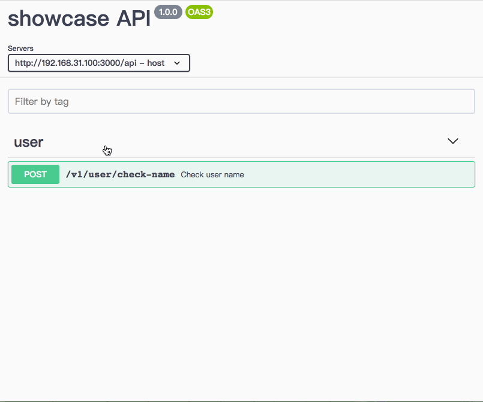
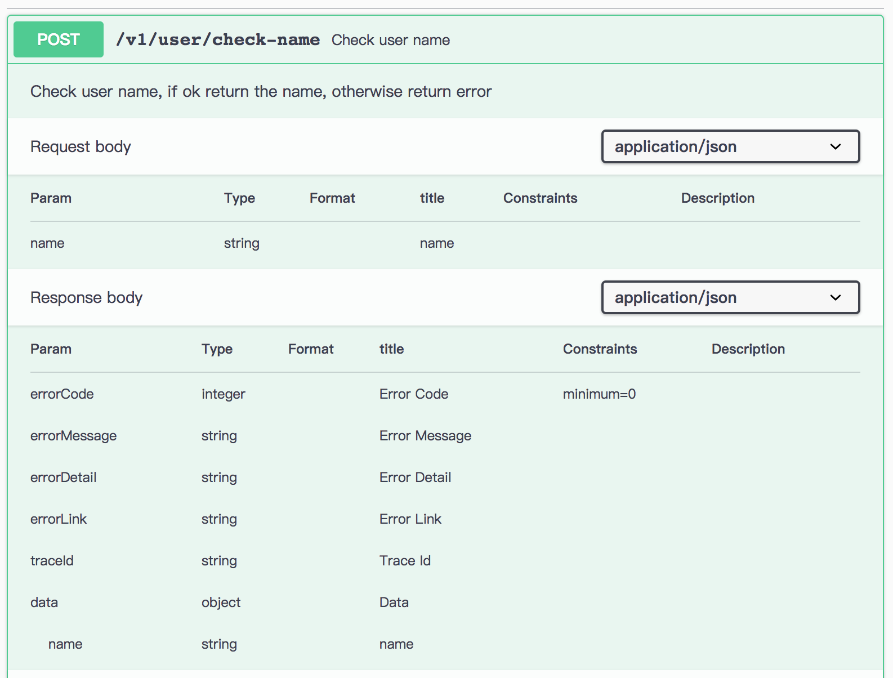

## Use markdown table to render request/response params


## Usage
work with `swagger-ui-express`:
```js
import express from 'express';
import yaml from 'js-yaml';
import swaggerUiExpress from 'swagger-ui-express';
import swaggerUiDist from 'brief-swagger-ui-dist';

/**
 *
 * @param {import('core/api/server').Server} server
 * @param {import('express').Router} router
 */
export async function buildSwaggerUi(server, router) {
  const swaggerJson = {...};

  // @ts-ignore
  // eslint-disable-next-line prefer-const
  let [swaggerInitJsRouter, swaggerUIStaticFileRouter] = swaggerUiExpress.serve;
  swaggerUIStaticFileRouter = express.static(swaggerUiDist.getAbsoluteFSPath(), { index: false });

  const indexHtmlRouter = swaggerUiExpress.setup(swaggerJson, {
    explorer: true,
    swaggerOptions: {
      filter: true,
      withCredentials: true,
    },
  });

  router.use(swaggerInitJsRouter, swaggerUIStaticFileRouter, indexHtmlRouter);
}

```